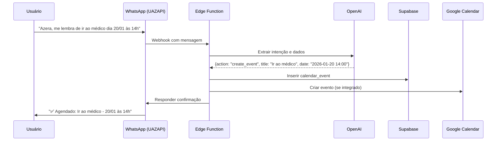
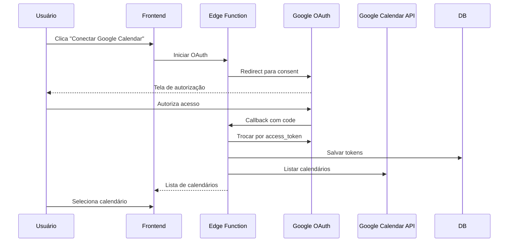

# Plano de Implementação: Agenda/Calendário com IA

## 📋 Visão Geral

Implementar um sistema de agenda inteligente no Azera CRM que:
1. Permite visualizar e gerenciar eventos/tarefas em um calendário
2. Integra com Google Calendar para sincronização
3. Processa comandos via WhatsApp (UAZAPI) para criar eventos automaticamente
4. Usa IA para interpretar comandos de linguagem natural

## 🏗️ Arquitetura

### Componentes Principais

```
┌─────────────────────────────────────────────────────────────────────┐
│                           FRONTEND (React)                          │
├─────────────────────────────────────────────────────────────────────┤
│  • Agenda.tsx - Página principal do calendário                      │
│  • AgendaCalendar.tsx - Componente de visualização                  │
│  • AgendaEventModal.tsx - Modal para criar/editar eventos           │
│  • AgendaSettings.tsx - Configurações (Google Calendar, etc)        │
└─────────────────────────────────────────────────────────────────────┘
                                   │
                                   ▼
┌─────────────────────────────────────────────────────────────────────┐
│                        SUPABASE (Database)                          │
├─────────────────────────────────────────────────────────────────────┤
│  • calendar_events - Eventos do calendário                          │
│  • calendar_integrations - Integrações (Google Calendar)            │
│  • tarefas - (existente) - Sincronização com tarefas                │
└─────────────────────────────────────────────────────────────────────┘
                                   │
                                   ▼
┌─────────────────────────────────────────────────────────────────────┐
│                    SUPABASE EDGE FUNCTIONS                          │
├─────────────────────────────────────────────────────────────────────┤
│  • agenda-process-message - Processa mensagens WhatsApp             │
│  • google-calendar-sync - Sincroniza com Google Calendar            │
│  • google-calendar-oauth - Fluxo OAuth do Google                    │
└─────────────────────────────────────────────────────────────────────┘
                                   │
                                   ▼
┌─────────────────────────────────────────────────────────────────────┐
│                      INTEGRAÇÕES EXTERNAS                           │
├─────────────────────────────────────────────────────────────────────┤
│  • UAZAPI (WhatsApp) - Receber/enviar mensagens                     │
│  • Google Calendar API - Sincronização de eventos                   │
│  • OpenAI API - Interpretação de comandos em linguagem natural      │
└─────────────────────────────────────────────────────────────────────┘
```

## 📊 Schema do Banco de Dados

### Tabela: `calendar_events`
```sql
CREATE TABLE calendar_events (
  id UUID PRIMARY KEY DEFAULT gen_random_uuid(),
  tenant_id UUID NOT NULL REFERENCES tenants(id),
  user_id UUID REFERENCES auth.users(id),

  -- Informações do evento
  title TEXT NOT NULL,
  description TEXT,
  location TEXT,

  -- Datas
  start_date TIMESTAMPTZ NOT NULL,
  end_date TIMESTAMPTZ,
  all_day BOOLEAN DEFAULT false,

  -- Recorrência
  recurrence_rule TEXT, -- RRULE format
  recurrence_end DATE,

  -- Relacionamentos
  tarefa_id UUID REFERENCES tarefas(id),
  cliente_id UUID REFERENCES clientes(id),

  -- Lembretes
  reminders JSONB DEFAULT '[]', -- [{type: 'whatsapp', minutes_before: 30}]

  -- Sincronização
  google_event_id TEXT,
  google_calendar_id TEXT,
  last_synced_at TIMESTAMPTZ,
  sync_status TEXT DEFAULT 'local', -- 'local', 'synced', 'error'

  -- Metadados
  color TEXT DEFAULT '#3B82F6',
  status TEXT DEFAULT 'confirmed', -- 'confirmed', 'tentative', 'cancelled'
  source TEXT DEFAULT 'manual', -- 'manual', 'whatsapp', 'google', 'task'
  source_message TEXT, -- Mensagem original (se criado via WhatsApp)

  created_at TIMESTAMPTZ DEFAULT now(),
  updated_at TIMESTAMPTZ DEFAULT now()
);

-- Índices
CREATE INDEX idx_calendar_events_tenant ON calendar_events(tenant_id);
CREATE INDEX idx_calendar_events_user ON calendar_events(user_id);
CREATE INDEX idx_calendar_events_dates ON calendar_events(start_date, end_date);
CREATE INDEX idx_calendar_events_google ON calendar_events(google_event_id);
```

### Tabela: `calendar_integrations`
```sql
CREATE TABLE calendar_integrations (
  id UUID PRIMARY KEY DEFAULT gen_random_uuid(),
  tenant_id UUID NOT NULL REFERENCES tenants(id),
  user_id UUID NOT NULL REFERENCES auth.users(id),

  -- Google Calendar OAuth
  provider TEXT NOT NULL DEFAULT 'google',
  access_token TEXT,
  refresh_token TEXT,
  token_expires_at TIMESTAMPTZ,

  -- Configurações
  calendar_id TEXT, -- ID do calendário selecionado
  calendar_name TEXT,
  sync_enabled BOOLEAN DEFAULT true,
  sync_direction TEXT DEFAULT 'both', -- 'to_google', 'from_google', 'both'
  last_sync_at TIMESTAMPTZ,

  -- Status
  status TEXT DEFAULT 'disconnected', -- 'connected', 'disconnected', 'error'
  error_message TEXT,

  created_at TIMESTAMPTZ DEFAULT now(),
  updated_at TIMESTAMPTZ DEFAULT now(),

  UNIQUE(tenant_id, user_id, provider)
);
```

## 🔄 Fluxos de Funcionamento

### Fluxo 1: Criar Evento via WhatsApp



### Fluxo 2: Integração Google Calendar



## 📁 Estrutura de Arquivos a Criar

```
src/
├── pages/
│   └── Agenda.tsx                    # Página principal
│
├── components/
│   └── agenda/
│       ├── AgendaCalendar.tsx        # Componente calendário
│       ├── AgendaEventModal.tsx      # Modal evento
│       ├── AgendaEventCard.tsx       # Card de evento
│       ├── AgendaDayView.tsx         # Visualização diária
│       ├── AgendaWeekView.tsx        # Visualização semanal
│       ├── AgendaMonthView.tsx       # Visualização mensal
│       └── AgendaSettings.tsx        # Configurações
│
├── services/
│   └── agendaService.ts              # Serviço de agenda
│
├── hooks/
│   ├── useCalendarEvents.ts          # Hook para eventos
│   └── useGoogleCalendar.ts          # Hook para integração
│
└── types/
    └── calendar.ts                   # Tipos TypeScript

supabase/functions/
├── agenda-process-message/           # Processar mensagens WhatsApp
├── google-calendar-oauth/            # OAuth do Google
└── google-calendar-sync/             # Sincronização

sql/
└── calendar_tables.sql               # Criar tabelas
```

## 🎯 Fases de Implementação

### Fase 1: Base do Calendário (Prioridade Alta)
1. Criar tabelas do banco de dados
2. Criar página Agenda.tsx com visualização básica
3. CRUD de eventos
4. Associar eventos com tarefas existentes

### Fase 2: Integração WhatsApp/IA (Prioridade Alta)
1. Edge function para processar mensagens
2. Integração com OpenAI para NLP
3. Comandos suportados:
   - "me lembra de X no dia Y às Z"
   - "cria uma tarefa para X"
   - "agenda reunião com Y"
   - "quais meus compromissos de hoje?"

### Fase 3: Integração Google Calendar (Prioridade Média)
1. Fluxo OAuth
2. Sincronização bidirecional
3. Seleção de calendário

### Fase 4: Lembretes e Notificações (Prioridade Média)
1. Lembretes via WhatsApp
2. Cron job para verificar lembretes
3. Configurações de preferências

## 🔧 Comandos WhatsApp Suportados

| Comando | Exemplo | Ação |
|---------|---------|------|
| Criar lembrete | "Azera, me lembra de pagar conta dia 20" | Cria evento |
| Criar tarefa | "Azera, cria uma tarefa pra ligar pro João" | Cria tarefa |
| Agendar | "Azera, agenda reunião com cliente amanhã 10h" | Cria evento |
| Listar | "Azera, quais meus compromissos de hoje?" | Lista eventos |
| Cancelar | "Azera, cancela o lembrete do médico" | Remove evento |

## 📱 UI/UX do Calendário

### Visualizações
- **Mês**: Grade tradicional com eventos
- **Semana**: Timeline horizontal com horas
- **Dia**: Lista detalhada de eventos
- **Lista**: Próximos eventos em lista

### Cores de Eventos
- 🔵 Azul: Eventos manuais
- 🟢 Verde: Synced com Google
- 🟣 Roxo: Criado via WhatsApp
- 🟠 Laranja: Vinculado a tarefa

## 🔐 Segurança

- Tokens do Google armazenados encriptados
- RLS para isolamento por tenant/user
- Validação de origem em webhooks
- Rate limiting em Edge Functions

## 📅 Cronograma Estimado

| Fase | Tempo | Dependências |
|------|-------|--------------|
| Fase 1 | 2-3 horas | Nenhuma |
| Fase 2 | 3-4 horas | Fase 1, OpenAI API |
| Fase 3 | 4-5 horas | Fase 1, Google Cloud Project |
| Fase 4 | 2-3 horas | Fase 2 |

---

## 🚀 Próximos Passos

1. **Criar SQL das tabelas**
2. **Criar página Agenda.tsx base**
3. **Criar serviço agendaService.ts**
4. **Implementar visualização mensal**
5. **Testar CRUD básico**
