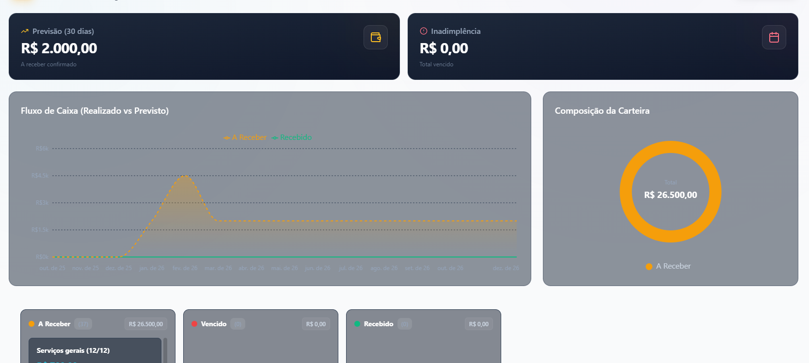

# 📱 20 POSTS INSTAGRAM - AZERA CRM
## Calendário de Conteúdo para Marketing Digital

---

## 📋 ÍNDICE DE POSTS

1. [Perda de Leads por Desorganização](#post-1) - **Problema Principal**
2. [WhatsApp Virou Bagunça](#post-2) - **Dor Específica**
3. [Planilha é Mentira](#post-3) - **Destruição de Objeção**
4. [Corretor Fantasma](#post-4) - **Problema de Equipe**
5. [Lead Frio que Comprou](#post-5) - **Case/Prova Social**
6. [Reunião de 2 Horas](#post-6) - **Desperdício de Tempo**
7. [Cliente Pergunta 3x](#post-7) - **Falta de Histórico**
8. [Comissão Perdida](#post-8) - **Dor Financeira**
9. [Gestor Cego](#post-9) - **Problema de Gestão**
10. [Funil Furado](#post-10) - **Métrica/Conversão**
11. [Atendimento Duplicado](#post-11) - **Desperdício de Recurso**
12. [Follow-up Inexistente](#post-12) - **Oportunidade Perdida**
13. [Equipe Desmotivada](#post-13) - **Problema Humano**
14. [Concorrente Mais Rápido](#post-14) - **Urgência**
15. [Relatório Fake](#post-15) - **Falta de Dados Reais**
16. [Expansão Impossível](#post-16) - **Crescimento Limitado**
17. [Onboarding Caótico](#post-17) - **Novo Corretor**
18. [Cliente VIP Perdido](#post-18) - **Priorização**
19. [ROI Invisível](#post-19) - **Investimento sem Retorno**
20. [Transformação Real](#post-20) - **Inspiracional/CTA Final**

---

## POST 1
### 🎯 Perda de Leads por Desorganização

**FRASE DO VÍDEO:**
```
Você não perde leads por falta de tráfego.
Perde por falta de organização.

👇 Leia a legenda
```

**LEGENDA:**
```
Referência não vem de ter mais leads.
Vem de não perder os que já chegam.

A maioria das imobiliárias acha que o problema é anúncio.

Não é.

O problema é esse aqui 👇

Você recebe lead no WhatsApp
Alguém responde
Outro corretor entra na conversa
Ninguém anota nada
Ninguém acompanha
E no fim… ninguém sabe se fechou ou se perdeu.

Isso não é falta de venda.
É falta de organização.

❌ Planilha não resolve:
"Usamos Excel pra controlar os leads."

✅ O que funciona de verdade:
Método Zero Planilhas do Azera
→ Leads organizados automaticamente
→ Responsável definido por lead
→ Histórico completo visível
→ Tudo no mesmo lugar

O que acontece na prática:

Semana 1: "Isso é simples demais"
Semana 2: "Caramba, não perdi nenhum lead"
Mês 1: Equipe inteira trabalhando no método

Sem improviso. Sem planilha. Sem lead perdido.

A verdade:
Quem controla lead em planilha não controla nada.
Só adia o problema.

👉 Cansou de perder lead por desorganização?

Teste o Azera CRM grátis por 7 dias
Link na bio 🔗

#CRM #Imobiliaria #GestaoDeLeads #CorretorDeImoveis #VendasImobiliarias #MetodoZeroPlanilhas
```

---

## POST 2
### 📱 WhatsApp Virou Bagunça

**FRASE DO VÍDEO:**
```
Seu WhatsApp tem 47 conversas abertas.
Quantas viraram venda?

👇 Te conto o problema
```

**LEGENDA:**
```
WhatsApp cheio não é sinal de sucesso.
É sinal de descontrole.

Você abre o app e vê:
→ 47 conversas não lidas
→ 12 leads esperando resposta há 3 dias
→ 5 clientes perguntando a mesma coisa
→ 0 ideia de quem está perto de fechar

E aí você faz o quê?

Responde os mais recentes.
Esquece os antigos.
E perde venda sem nem perceber.

O problema não é o volume.
É a falta de sistema.

❌ Não funciona:
"Vou responder todo mundo hoje"

✅ Funciona:
Sistema que organiza, prioriza e lembra você de cada lead no momento certo.

Com o Azera CRM:
→ Leads categorizados por interesse
→ Alertas automáticos de follow-up
→ Histórico completo em cada conversa
→ Você sabe exatamente quem precisa de atenção

Resultado:
Menos ansiedade.
Mais conversão.
Zero lead esquecido.

A verdade:
WhatsApp é pra conversar.
CRM é pra vender.

👉 Quer organizar seu caos de leads?

Teste grátis por 7 dias
Link na bio 🔗

#WhatsAppBusiness #GestaoDeLeads #CRM #Imobiliaria #CorretorDeImoveis #Produtividade
```

---

## POST 3
### 📊 Planilha é Mentira

**FRASE DO VÍDEO:**
```
"A gente usa planilha pra controlar os leads."

Não usa. Você só finge que controla.

👇 Explico aqui
```

**LEGENDA:**
```
Planilha não é controle.
É teatro.

Você abre a planilha e vê:
→ 80% das linhas desatualizadas
→ Ninguém sabe quem preencheu
→ Status genérico tipo "em andamento"
→ Última atualização: 15 dias atrás

E quando alguém pergunta:
"Esse lead fechou?"

Ninguém sabe.

Porque planilha não acompanha a realidade.
Ela só registra o que alguém LEMBROU de anotar.

❌ Problemas da planilha:
→ Depende de disciplina manual
→ Ninguém atualiza em tempo real
→ Não tem histórico de conversas
→ Impossível saber o que aconteceu

✅ Como funciona de verdade:
→ Sistema atualiza sozinho
→ Histórico automático de cada ação
→ Status real, não inventado
→ Dados confiáveis pra tomar decisão

A diferença:

Planilha = Você finge que controla
CRM = Você realmente controla

E a melhor parte?
Não precisa treinar ninguém a "preencher direito".
O sistema já faz isso.

A verdade:
Se você precisa LEMBRAR de atualizar,
você não tem controle.

👉 Quer sair do teatro e entrar na gestão real?

Teste o Azera CRM grátis
Link na bio 🔗

#Planilha #Excel #CRM #GestaoDeLeads #Imobiliaria #CorretorDeImoveis #Produtividade
```

---

## POST 4
### 👻 Corretor Fantasma

**FRASE DO VÍDEO:**
```
Você tem um corretor fantasma na equipe.

Ele atende, mas ninguém sabe o quê.

👇 Continua aqui
```

**LEGENDA:**
```
Sabe aquele corretor que:
→ Diz que está atendendo
→ Sempre está "ocupado"
→ Nunca fecha nada
→ Mas também nunca admite que perdeu?

Esse é o fantasma.

E o pior:
Você não consegue provar nada.

Porque não tem como saber:
→ Quantos leads ele realmente pegou
→ Quantas vezes ele fez follow-up
→ Onde o lead travou
→ Se ele mentiu ou só foi azar

Resultado?
Você fica no achismo.
Ele fica na zona de conforto.
E a imobiliária perde dinheiro.

❌ Gestão no escuro:
"Fulano, você atendeu aquele lead?"
"Atendi sim, mas ele não tinha interesse."

✅ Gestão com dados:
→ Você vê cada interação registrada
→ Sabe quantos follow-ups foram feitos
→ Identifica onde o lead esfriou
→ Toma decisão baseada em fato, não em desculpa

Com o Azera CRM:
Não existe mais "achismo".
Só existe histórico.

E quando você tem histórico,
o fantasma vira produtivo ou vira ex-funcionário.

A verdade:
Equipe sem controle = Prejuízo sem explicação.

👉 Quer ter visibilidade total da sua equipe?

Teste grátis por 7 dias
Link na bio 🔗

#GestaoDeEquipe #CRM #Imobiliaria #CorretorDeImoveis #Produtividade #Lideranca
```

---

## POST 5
### 🔥 Lead Frio que Comprou

**FRASE DO VÍDEO:**
```
"Esse lead está frio, pode descartar."

3 meses depois ele comprou.
Com o concorrente.

👇 Por que isso acontece
```

**LEGENDA:**
```
Lead frio não existe.
Existe lead mal acompanhado.

A história é sempre a mesma:

Cliente entra em contato.
Corretor atende.
Cliente diz "vou pensar".
Corretor anota "sem interesse".
E esquece.

3 meses depois:
Cliente compra o imóvel.
Mas não com você.

Por quê?

Porque você desistiu.
E o concorrente continuou.

❌ O que a maioria faz:
→ Atende 1 vez
→ Cliente não compra na hora
→ Marca como "frio"
→ Nunca mais fala com ele

✅ O que quem vende faz:
→ Atende 1 vez
→ Agenda follow-up automático
→ Nutre o lead com conteúdo
→ Está lá quando ele decide comprar

Com o Azera CRM:
→ Follow-ups automáticos programados
→ Lembretes pra não esquecer ninguém
→ Histórico completo de cada interação
→ Lead "frio" vira oportunidade quente

A diferença entre perder e vender
não é o lead.
É o acompanhamento.

A verdade:
Cliente não compra quando VOCÊ quer.
Compra quando ELE está pronto.

E se você não estiver lá nessa hora,
o concorrente vai estar.

👉 Quer parar de perder lead "frio"?

Teste o Azera CRM grátis
Link na bio 🔗

#FollowUp #GestaoDeLeads #CRM #Imobiliaria #VendasImobiliarias #CorretorDeImoveis
```

---

## POST 6
### ⏰ Reunião de 2 Horas

**FRASE DO VÍDEO:**
```
Reunião de equipe: 2 horas.
Decisão tomada: nenhuma.

👇 O problema está aqui
```

**LEGENDA:**
```
Você marca reunião pra "alinhar a equipe".

E o que acontece?

→ Ninguém sabe quantos leads entraram
→ Ninguém sabe quantos fecharam
→ Cada um dá um número diferente
→ Vocês passam 1 hora discutindo "achismos"

No final:
2 horas perdidas.
Zero decisão tomada.
Todo mundo mais confuso.

O problema não é a equipe.
É a falta de dados.

❌ Reunião sem dados:
"Acho que entraram uns 30 leads essa semana"
"Não, foram uns 40"
"Mas quantos fecharam?"
"Não sei, vou ver e te falo"

✅ Reunião com dados:
→ Dashboard aberto na tela
→ Números exatos em tempo real
→ Todo mundo vendo a mesma coisa
→ Decisões tomadas em 20 minutos

Com o Azera CRM:
→ Relatórios automáticos
→ Métricas atualizadas em tempo real
→ Visão completa do funil
→ Reunião vira ação, não conversa

Resultado:
Reunião de 2 horas vira 30 minutos.
E você sai com decisões, não com dúvidas.

A verdade:
Reunião sem dado é terapia em grupo.
Não é gestão.

👉 Quer reuniões produtivas de verdade?

Teste grátis por 7 dias
Link na bio 🔗

#Gestao #Produtividade #CRM #Imobiliaria #Lideranca #CorretorDeImoveis
```

---

## POST 7
### 🔁 Cliente Pergunta 3x

**FRASE DO VÍDEO:**
```
Cliente: "Qual o valor do IPTU mesmo?"

Você: "Já te passei isso"

Mas não sabe onde.

👇 Esse é o problema
```

**LEGENDA:**
```
Cliente pergunta.
Você responde.
Cliente pergunta de novo.
Você procura a resposta por 10 minutos.

E pensa:
"Eu JÁ respondi isso!"

Mas onde?
→ Foi no WhatsApp?
→ Foi no e-mail?
→ Foi na ligação?
→ Ou você só ACHA que respondeu?

Resultado:
Você perde tempo.
Cliente perde paciência.
E a venda esfria.

O problema não é o cliente.
É a falta de histórico centralizado.

❌ Sem histórico:
→ Informação espalhada em 5 lugares
→ Você não lembra o que já falou
→ Cliente repete a mesma pergunta
→ Você parece desorganizado

✅ Com histórico:
→ Tudo registrado em um só lugar
→ Você abre e vê toda a conversa
→ Responde em 10 segundos
→ Cliente sente que você é profissional

Com o Azera CRM:
→ Histórico completo de cada lead
→ Todas as interações registradas
→ Busca rápida por qualquer informação
→ Você nunca mais fica perdido

A diferença:
Sem CRM = "Deixa eu procurar aqui"
Com CRM = "Está aqui, é R$ X"

A verdade:
Cliente que precisa repetir pergunta
é cliente que está pensando em desistir.

👉 Quer ter todas as respostas na mão?

Teste o Azera CRM grátis
Link na bio 🔗

#Atendimento #CRM #Imobiliaria #CorretorDeImoveis #ExperienciaDoCliente #Vendas
```

---

## POST 8
### 💰 Comissão Perdida

**FRASE DO VÍDEO:**
```
Você perdeu R$ 15 mil de comissão esse mês.

E nem percebeu.

👇 Te mostro onde
```

**LEGENDA:**
```
Não é exagero.
É matemática.

Vamos fazer a conta:

→ 100 leads entraram esse mês
→ 40 foram atendidos
→ 60 ficaram sem resposta

Taxa de conversão média: 5%
Ticket médio: R$ 500 mil
Comissão: 6%

60 leads × 5% = 3 vendas perdidas
3 vendas × R$ 500k × 6% = R$ 90 mil

Sua parte: R$ 15 mil

Perdidos.
Por desorganização.

❌ O que acontece:
→ Lead entra e ninguém vê
→ Ou vê e esquece de responder
→ Ou responde e não faz follow-up
→ Lead compra com o concorrente

✅ O que deveria acontecer:
→ Lead entra e é distribuído automaticamente
→ Corretor recebe notificação
→ Follow-up é agendado
→ Nada cai no esquecimento

Com o Azera CRM:
→ Nenhum lead fica sem dono
→ Alertas automáticos de follow-up
→ Funil visível pra toda equipe
→ Você converte mais com os mesmos leads

A verdade:
Você não precisa de mais tráfego.
Precisa parar de desperdiçar o que já tem.

Porque cada lead perdido
é dinheiro saindo do seu bolso.

👉 Quer parar de perder comissão?

Teste grátis por 7 dias
Link na bio 🔗

#Comissao #VendasImobiliarias #CRM #Imobiliaria #CorretorDeImoveis #GestaoDeLeads
```

---

## POST 9
### 👔 Gestor Cego

**FRASE DO VÍDEO:**
```
Você é gestor, mas não sabe:

Quantos leads entraram hoje.
Quem atendeu.
Quem fechou.

👇 Isso é gestão?
```

**LEGENDA:**
```
Ser gestor não é ter o cargo.
É ter o controle.

E você não tem controle se precisa:
→ Perguntar pra equipe quantos leads entraram
→ Esperar alguém te mandar relatório
→ Adivinhar quem está produzindo
→ Descobrir os números só no fim do mês

Isso não é gestão.
É improviso.

❌ Gestor no escuro:
"Fulano, quantos leads você atendeu essa semana?"
"Uns 10, acho"
"E quantos fecharam?"
"Vou ver e te falo"

✅ Gestor com visão:
→ Dashboard aberto
→ Números em tempo real
→ Sabe exatamente quem está produzindo
→ Toma decisão baseada em dados, não em "acho"

Com o Azera CRM:
→ Visão completa do funil de vendas
→ Performance individual de cada corretor
→ Métricas atualizadas automaticamente
→ Você lidera com dados, não com achismo

Resultado:
Você para de perguntar.
E começa a decidir.

A verdade:
Gestor que depende da equipe pra saber os números
não é gestor.
É refém.

👉 Quer ter controle real da sua operação?

Teste o Azera CRM grátis
Link na bio 🔗

#Gestao #Lideranca #CRM #Imobiliaria #CorretorDeImoveis #Dashboard #Metricas
```

---

## POST 10
### 📉 Funil Furado

**FRASE DO VÍDEO:**
```
100 leads entraram.
2 viraram venda.

O problema não é o lead.
É o funil.

👇 Te explico
```

**LEGENDA:**
```
Taxa de conversão de 2% não é normal.
É sintoma de funil furado.

Vamos ver onde o lead se perde:

→ 100 leads entram
→ 60 são atendidos (40 perdidos aqui)
→ 30 recebem follow-up (30 perdidos aqui)
→ 10 chegam na visita (20 perdidos aqui)
→ 2 fecham (8 perdidos aqui)

Cada etapa é um buraco.
E você está perdendo dinheiro em todas.

O pior:
Você nem sabe onde está o maior vazamento.

❌ Sem visibilidade:
→ Você só vê o resultado final
→ Não sabe onde o lead travou
→ Não consegue corrigir o problema
→ Continua perdendo do mesmo jeito

✅ Com visibilidade:
→ Você vê cada etapa do funil
→ Identifica onde está o gargalo
→ Corrige o problema específico
→ Aumenta conversão sem gastar mais

Com o Azera CRM:
→ Funil visual e atualizado em tempo real
→ Taxa de conversão por etapa
→ Você sabe exatamente onde melhorar
→ Decisões baseadas em dados, não em achismo

A diferença:
Sem CRM = "Acho que o problema é X"
Com CRM = "O problema É X, e vou corrigir assim"

A verdade:
Você não precisa de mais leads.
Precisa parar de perder os que já tem.

👉 Quer tapar os buracos do seu funil?

Teste grátis por 7 dias
Link na bio 🔗

#FunilDeVendas #Conversao #CRM #Imobiliaria #VendasImobiliarias #Metricas
```

---

## POST 11
### 🔄 Atendimento Duplicado

**FRASE DO VÍDEO:**
```
2 corretores atendendo o mesmo lead.

Nenhum dos dois sabe.

👇 Adivinha o que acontece
```

**LEGENDA:**
```
Cliente manda mensagem.
Corretor A responde.
Cliente manda de novo em outro canal.
Corretor B responde.

Resultado:
→ 2 corretores trabalhando no mesmo lead
→ Cliente recebe 2 propostas diferentes
→ Equipe briga por comissão
→ Cliente acha que vocês são desorganizados

E são.

Porque não tem como saber:
→ Quem já atendeu aquele lead
→ O que foi prometido
→ Qual proposta foi enviada
→ Quem é o responsável

❌ Caos na equipe:
"Esse lead é meu, eu atendi primeiro!"
"Não, ele me mandou mensagem ontem!"
"Mas eu já enviei proposta!"

✅ Organização real:
→ Lead entra e é atribuído automaticamente
→ Só 1 corretor é o responsável
→ Todo mundo vê quem está atendendo
→ Zero duplicidade, zero conflito

Com o Azera CRM:
→ Distribuição automática de leads
→ Responsável definido e visível
→ Histórico compartilhado
→ Equipe trabalha junto, não um contra o outro

A verdade:
Atendimento duplicado não é sinal de empenho.
É sinal de desorganização.

E cliente desorganizado não compra.
Ele foge.

👉 Quer acabar com conflito de equipe?

Teste o Azera CRM grátis
Link na bio 🔗

#GestaoDeEquipe #CRM #Imobiliaria #CorretorDeImoveis #Organizacao #Produtividade
```

---

## POST 12
### 📞 Follow-up Inexistente

**FRASE DO VÍDEO:**
```
"Vou ligar pra ele amanhã."

Você não vai.
E o lead sabe disso.

👇 Por que follow-up não acontece
```

**LEGENDA:**
```
Todo corretor diz que faz follow-up.
Quase nenhum faz.

Não por má vontade.
Mas porque:

→ Esquece
→ Fica com preguiça
→ Acha que o cliente vai ligar
→ Não sabe quando é a hora certa

Resultado:
Lead esfria.
Concorrente aquece.
Você perde a venda.

❌ Follow-up na memória:
"Vou ligar pra ele sexta"
Sexta chega → esqueceu
Segunda lembra → "já passou, deixa pra lá"

✅ Follow-up no sistema:
→ Sistema agenda automaticamente
→ Notificação no dia e hora certos
→ Você não precisa lembrar
→ Só precisa executar

Com o Azera CRM:
→ Follow-ups programados por lead
→ Alertas automáticos
→ Histórico de todas as tentativas
→ Você nunca mais esquece ninguém

A diferença entre vender e perder
muitas vezes é só 1 follow-up.

Aquele que você prometeu fazer.
Mas esqueceu.

A verdade:
Follow-up que depende de memória
não é follow-up.
É loteria.

👉 Quer follow-up que realmente acontece?

Teste grátis por 7 dias
Link na bio 🔗

#FollowUp #VendasImobiliarias #CRM #Imobiliaria #CorretorDeImoveis #Produtividade
```

---

## POST 13
### 😤 Equipe Desmotivada

**FRASE DO VÍDEO:**
```
Sua equipe não está desmotivada.

Está perdida.

👇 A diferença está aqui
```

**LEGENDA:**
```
Corretor desmotivado não é preguiçoso.
É desorientado.

Ele não sabe:
→ Quantos leads ele tem
→ Quais são prioridade
→ O que fazer agora
→ Se está indo bem ou mal

Resultado:
Ele improvisa.
Faz qualquer coisa.
Não vê resultado.
E desanima.

O problema não é falta de vontade.
É falta de direção.

❌ Equipe sem norte:
→ Cada um faz do seu jeito
→ Ninguém sabe se está no caminho certo
→ Resultado é imprevisível
→ Motivação despenca

✅ Equipe com clareza:
→ Todo mundo sabe o que fazer
→ Métricas claras de sucesso
→ Feedback em tempo real
→ Motivação vem de resultado

Com o Azera CRM:
→ Cada corretor vê seus leads
→ Prioridades definidas automaticamente
→ Metas e progresso visíveis
→ Equipe sabe exatamente onde está

Resultado:
Corretor para de improvisar.
Começa a executar.
Vê resultado.
E se motiva.

A verdade:
Equipe desmotivada é sintoma.
A doença é falta de sistema.

👉 Quer uma equipe motivada de verdade?

Teste o Azera CRM grátis
Link na bio 🔗

#Motivacao #GestaoDeEquipe #CRM #Imobiliaria #Lideranca #CorretorDeImoveis
```

---

## POST 14
### ⚡ Concorrente Mais Rápido

**FRASE DO VÍDEO:**
```
Lead entrou às 14h.
Você respondeu às 18h.
Concorrente respondeu às 14h05.

Adivinha quem vendeu?

👇 Velocidade mata
```

**LEGENDA:**
```
No mercado imobiliário,
quem chega primeiro vende.

Cliente manda mensagem pra 5 imobiliárias.
A primeira que responde tem 80% de chance de fechar.

As outras 4?
Estão brigando pelos 20% restantes.

Você acha que tem tempo.
Não tem.

❌ Resposta lenta:
→ Lead entra às 14h
→ Corretor está almoçando
→ Vê às 16h, mas está ocupado
→ Responde às 18h
→ Cliente já agendou visita com outro

✅ Resposta rápida:
→ Lead entra às 14h
→ Sistema notifica na hora
→ Corretor responde em 5 minutos
→ Cliente agenda com você

Com o Azera CRM:
→ Notificações em tempo real
→ Lead distribuído automaticamente
→ Corretor responde na hora
→ Você sempre chega primeiro

A diferença entre vender e perder
muitas vezes é 10 minutos.

Aqueles 10 minutos que você demorou pra ver o lead.

A verdade:
Cliente quente não espera.
Ele compra de quem responde primeiro.

👉 Quer ser sempre o primeiro a responder?

Teste grátis por 7 dias
Link na bio 🔗

#Velocidade #VendasImobiliarias #CRM #Imobiliaria #CorretorDeImoveis #Atendimento
```

---

## POST 15
### 📊 Relatório Fake

**FRASE DO VÍDEO:**
```
"Mandei 50 propostas esse mês."

Mentira.
Você mandou 12.

👇 Como eu sei?
```

**LEGENDA:**
```
Não é que seu corretor seja mentiroso.
É que ele não lembra.

Você pergunta:
"Quantas propostas você mandou?"

Ele responde:
"Umas 50"

Mas na real foram 12.

Porque:
→ Ele conta as que pensou em mandar
→ Conta as que começou e não terminou
→ Conta as que mandou mês passado
→ Ou simplesmente chuta um número

E você acredita.
Porque não tem como provar o contrário.

❌ Relatório de memória:
→ Números inventados
→ Impossível validar
→ Decisões baseadas em mentira
→ Resultado: prejuízo

✅ Relatório automático:
→ Números exatos
→ Tudo registrado
→ Impossível mentir
→ Decisões baseadas em fato

Com o Azera CRM:
→ Cada ação é registrada automaticamente
→ Relatórios gerados em tempo real
→ Você vê exatamente o que aconteceu
→ Ninguém precisa "lembrar" de nada

A diferença:
Sem CRM = "Acho que foram umas 50"
Com CRM = "Foram exatamente 12"

A verdade:
Relatório que depende de memória
não é relatório.
É ficção.

👉 Quer dados reais, não inventados?

Teste o Azera CRM grátis
Link na bio 🔗

#Relatorios #Metricas #CRM #Imobiliaria #Gestao #CorretorDeImoveis
```

---

## POST 16
### 📈 Expansão Impossível

**FRASE DO VÍDEO:**
```
Você quer contratar mais 3 corretores.

Mas mal consegue gerenciar os 2 que tem.

👇 O problema está aqui
```

**LEGENDA:**
```
Crescer sem sistema não é crescer.
É multiplicar o caos.

Você pensa:
"Vou contratar mais gente pra vender mais"

Mas esquece que:
→ Você já não consegue acompanhar a equipe atual
→ Não sabe quem está produzindo
→ Não tem processo definido
→ Cada um faz do seu jeito

Resultado:
Você contrata mais 3.
O caos vira 3x maior.
E você vende a mesma coisa (ou menos).

❌ Crescimento sem base:
→ Mais gente = mais confusão
→ Você perde o controle
→ Produtividade cai
→ Custo sobe, receita não

✅ Crescimento estruturado:
→ Sistema que escala sozinho
→ Processo claro pra todo mundo
→ Você acompanha 2 ou 20 do mesmo jeito
→ Mais gente = mais resultado

Com o Azera CRM:
→ Onboarding automático de novos corretores
→ Processo padronizado pra toda equipe
→ Gestão escalável
→ Você cresce sem perder controle

A verdade:
Se você não consegue gerenciar 2,
não vai conseguir gerenciar 5.

O problema não é o tamanho da equipe.
É a falta de sistema.

👉 Quer crescer de verdade?

Teste o Azera CRM grátis
Link na bio 🔗

#Crescimento #Escalabilidade #CRM #Imobiliaria #Gestao #CorretorDeImoveis
```

---

## POST 17
### 🆕 Onboarding Caótico

**FRASE DO VÍDEO:**
```
Novo corretor chegou.

Ninguém sabe o que ensinar.
Ele não sabe o que fazer.

👇 Isso é normal?
```

**LEGENDA:**
```
Primeiro dia do corretor novo:

9h: "Bem-vindo! Senta aí"
10h: "Dá uma olhada nos imóveis"
11h: "Qualquer dúvida, pergunta"
12h: Almoço
14h: "Ah, chegou um lead pra você"

E ele não sabe:
→ Como acessar os imóveis
→ Onde estão as informações
→ Como registrar o atendimento
→ Pra quem pedir ajuda

Resultado:
Ele improvisa.
Atende mal.
Perde lead.
E você acha que ele é ruim.

Mas o problema não é ele.
É o onboarding.

❌ Onboarding improvisado:
→ Cada um ensina uma coisa diferente
→ Novo corretor fica perdido
→ Leva semanas pra produzir
→ Muitos desistem antes

✅ Onboarding estruturado:
→ Processo claro desde o dia 1
→ Tudo documentado no sistema
→ Novo corretor produz na semana 1
→ Menos turnover, mais resultado

Com o Azera CRM:
→ Acesso imediato a todos os dados
→ Processo visível e padronizado
→ Novo corretor sabe exatamente o que fazer
→ Você escala a equipe sem dor de cabeça

A verdade:
Corretor ruim muitas vezes é só
corretor mal treinado.

👉 Quer onboarding que funciona?

Teste o Azera CRM grátis
Link na bio 🔗

#Onboarding #Treinamento #CRM #Imobiliaria #GestaoDeEquipe #CorretorDeImoveis
```

---

## POST 18
### 💎 Cliente VIP Perdido

**FRASE DO VÍDEO:**
```
Cliente com orçamento de R$ 2 milhões.

Foi atendido igual a todo mundo.

E comprou com o concorrente.

👇 Por que isso acontece
```

**LEGENDA:**
```
Nem todo lead é igual.
Mas você trata todos do mesmo jeito.

Cliente VIP:
→ Orçamento alto
→ Pronto pra comprar
→ Precisa de atenção especial

O que ele recebe:
→ Resposta padrão
→ Atendimento genérico
→ Zero priorização

Resultado:
Ele vai pra concorrência.
E você perde a maior venda do mês.

❌ Sem priorização:
→ Lead de R$ 2 milhões na mesma fila que lead de R$ 200 mil
→ Corretor não sabe quem é prioridade
→ Cliente VIP espera igual todo mundo
→ Você perde a venda grande

✅ Com priorização:
→ Sistema identifica leads de alto valor
→ Alerta automático pro melhor corretor
→ Atendimento diferenciado
→ Você fecha as vendas que importam

Com o Azera CRM:
→ Tags e categorização de leads
→ Priorização automática por valor
→ Alertas especiais pra VIPs
→ Você nunca mais perde uma venda grande

A verdade:
Tratar todo lead igual
não é democracia.
É burrice.

Cliente de R$ 2 milhões merece atenção de R$ 2 milhões.

👉 Quer priorizar os leads certos?

Teste o Azera CRM grátis
Link na bio 🔗

#ClienteVIP #Priorizacao #CRM #Imobiliaria #VendasImobiliarias #CorretorDeImoveis
```

---

## POST 19
### 💸 ROI Invisível

**FRASE DO VÍDEO:**
```
Você gasta R$ 10 mil em anúncio.

Não sabe quantos leads viraram venda.

👇 Como calcular ROI assim?
```

**LEGENDA:**
```
Você investe em:
→ Google Ads
→ Facebook Ads
→ Instagram Ads
→ Portal imobiliário

Total: R$ 10 mil/mês

Pergunta:
Quanto disso virou venda?

Resposta:
"Não sei"

E aí você continua investindo.
Sem saber se está dando retorno.

❌ Investimento no escuro:
→ Você gasta, mas não rastreia
→ Não sabe qual canal converte
→ Não sabe qual anúncio funciona
→ Continua gastando igual

✅ Investimento inteligente:
→ Cada lead tem origem rastreada
→ Você sabe qual canal converte mais
→ Corta o que não funciona
→ Dobra o que funciona

Com o Azera CRM:
→ Rastreamento de origem de cada lead
→ ROI por canal de aquisição
→ Você sabe exatamente onde investir
→ Menos desperdício, mais resultado

A diferença:
Sem CRM = "Vamos continuar investindo e ver no que dá"
Com CRM = "Canal X tem ROI de 300%, vamos dobrar o investimento"

A verdade:
Investir sem medir ROI
não é marketing.
É jogar dinheiro fora.

👉 Quer saber onde seu dinheiro rende mais?

Teste o Azera CRM grátis
Link na bio 🔗

#ROI #MarketingDigital #CRM #Imobiliaria #GoogleAds #FacebookAds #Metricas
```

---

## POST 20
### 🚀 Transformação Real

**FRASE DO VÍDEO:**
```
Há 6 meses:
Caos total.

Hoje:
Equipe organizada, vendas em alta.

👇 O que mudou?
```

**LEGENDA:**
```
A história de toda imobiliária que cresce:

ANTES:
→ Leads perdidos
→ Equipe confusa
→ Planilhas desatualizadas
→ Reuniões improdutivas
→ Vendas imprevisíveis

DEPOIS:
→ Zero lead perdido
→ Equipe alinhada
→ Dados em tempo real
→ Decisões rápidas
→ Vendas consistentes

O que mudou?

Não foi contratar mais gente.
Não foi investir mais em anúncio.
Não foi "se esforçar mais".

Foi implementar um SISTEMA.

Porque:
→ Sistema organiza o caos
→ Sistema escala sem esforço
→ Sistema libera tempo
→ Sistema aumenta resultado

E a melhor parte?
Não precisa de meses pra ver resultado.

Semana 1: Organização
Semana 2: Menos lead perdido
Mês 1: Equipe trabalhando no método
Mês 3: Vendas em alta

A verdade:
Você não precisa trabalhar mais.
Precisa trabalhar com sistema.

E sistema não é complicado.
É simples.
É claro.
É o Azera CRM.

👉 Pronto pra transformar sua imobiliária?

Teste GRÁTIS por 7 dias
Link na bio 🔗

Pare de improvisar.
Comece a crescer.

#Transformacao #CRM #Imobiliaria #Crescimento #VendasImobiliarias #CorretorDeImoveis #AzeraCRM
```

---

## 📅 SUGESTÃO DE CALENDÁRIO DE POSTAGEM

### Semana 1 (Posts 1-5): IDENTIFICAÇÃO DO PROBLEMA
- **Seg**: Post 1 - Perda de Leads
- **Ter**: Post 2 - WhatsApp Bagunça
- **Qua**: Post 3 - Planilha é Mentira
- **Qui**: Post 4 - Corretor Fantasma
- **Sex**: Post 5 - Lead Frio que Comprou

### Semana 2 (Posts 6-10): CONSEQUÊNCIAS
- **Seg**: Post 6 - Reunião de 2 Horas
- **Ter**: Post 7 - Cliente Pergunta 3x
- **Qua**: Post 8 - Comissão Perdida
- **Qui**: Post 9 - Gestor Cego
- **Sex**: Post 10 - Funil Furado

### Semana 3 (Posts 11-15): PROBLEMAS OPERACIONAIS
- **Seg**: Post 11 - Atendimento Duplicado
- **Ter**: Post 12 - Follow-up Inexistente
- **Qua**: Post 13 - Equipe Desmotivada
- **Qui**: Post 14 - Concorrente Mais Rápido
- **Sex**: Post 15 - Relatório Fake

### Semana 4 (Posts 16-20): CRESCIMENTO E TRANSFORMAÇÃO
- **Seg**: Post 16 - Expansão Impossível
- **Ter**: Post 17 - Onboarding Caótico
- **Qua**: Post 18 - Cliente VIP Perdido
- **Qui**: Post 19 - ROI Invisível
- **Sex**: Post 20 - Transformação Real ⭐

---

## 🎨 DICAS DE PRODUÇÃO DOS VÍDEOS

### Formato Visual:
- **Fundo**: Gradiente escuro (preto/azul escuro) ou vídeo de imóveis em slow motion
- **Texto**: Branco, fonte bold, animação palavra por palavra
- **Duração**: 5-8 segundos
- **Música**: Instrumental épico/motivacional (baixo volume)

### Ferramentas Sugeridas:
- **CapCut**: Edição rápida e templates prontos
- **Canva**: Templates de vídeo para Instagram
- **InShot**: Edição mobile simples

### Elementos Visuais:
- Texto animado entrando da esquerda
- Emoji estratégico (👇, ❌, ✅)
- Transição suave
- CTA final "Leia a legenda 👇"

---

## 📊 MÉTRICAS PARA ACOMPANHAR

### Por Post:
- Alcance
- Engajamento (likes, comentários, salvamentos)
- Compartilhamentos
- Cliques no link da bio

### Geral da Campanha:
- Crescimento de seguidores
- Taxa de conversão (cliques → cadastros)
- Leads gerados
- Vendas atribuídas

---

## 🎯 HASHTAGS ESTRATÉGICAS

### Principais (usar em todos):
#CRM #Imobiliaria #CorretorDeImoveis #VendasImobiliarias #GestaoDeLeads

### Rotativas (variar por tema):
#MetodoZeroPlanilhas #Produtividade #Gestao #Lideranca #MarketingDigital #Crescimento #Escalabilidade #AtendimentoAoCliente #FunilDeVendas #ROI #WhatsAppBusiness

---

## ✅ CHECKLIST ANTES DE POSTAR

- [ ] Vídeo renderizado em alta qualidade (1080x1920)
- [ ] Legenda copiada e colada (verificar formatação)
- [ ] Hashtags incluídas
- [ ] Link da bio atualizado
- [ ] Horário de postagem otimizado (18h-21h)
- [ ] Primeira resposta nos comentários preparada
- [ ] Stories preparado para reforçar o post

---

## 💡 DICA FINAL

**Engajamento nos Comentários:**
Prepare respostas padrão para objeções comuns:

- "Quanto custa?" → "Manda DM que te passo os detalhes! 📩"
- "Funciona pra pequena imobiliária?" → "Funciona pra qualquer tamanho! Teste grátis e veja 🚀"
- "Já uso outro CRM" → "Qual você usa? Te mostro as diferenças no DM 💬"

---

**BOA SORTE COM A CAMPANHA! 🚀**

Se precisar de ajustes em algum post específico, é só falar!
